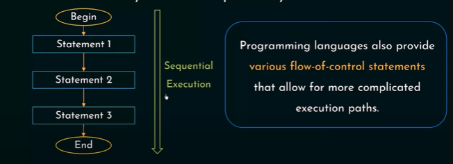

# Flow of Control

## Definition

`Define` in computer science, `control flow` (or `flow of control`) is the order in which individual statements, instructions or function calls of an imperative program are executed or evaluated.

`Source` [link](https://en.wikipedia.org/wiki/Control_flow#:~:text=In%20computer%20science%2C%20control%20flow,from%20a%20declarative%20programming%20language.)

`I know I know wikipedia is not the best source but i found this definition easy to understand.`

Statements normally execute sequentially:

Screenshot from [Link](https://www.youtube.com/watch?v=iF4i423144E&list=PLBlnK6fEyqRh6isJ01MBnbNpV3ZsktSyS&index=10)

## `How to remove meta data from a photo` [link](https://www.microsoft.com/en-us/microsoft-365-life-hacks/privacy-and-safety/how-to-remove-metadata-from-photos)

## Types of Control structure

- `Sequential`: default mode. Sequential execution of code statements (one line after another) -- like following a recipe
- `Selection`: used for decisions, branching -- choosing between 2 or more alternative paths. In C++, these are the types of selection statements:
  - `if`
  - `if/else`
  - `switch`

- `Repetition`: used for looping, i.e. repeating a piece of code multiple times in a row. In C++, there are three types of loops:
  - `while`
  - `do/while`
  - `for`
