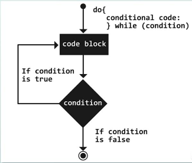

# Do while loop

## Definition

A do while loop is a control flow statement that executes a block of code at least once, and then repeatedly executes the block, or not, depending on a given boolean condition at the end of the block.

`source` [link](https://press.rebus.community/programmingfundamentals/chapter/do-while-loop/#:~:text=Overview,the%20end%20of%20the%20block.)



```c++
#include <iostream>
int main()
{
    int i = 1;
    do 
    {
        std::cout<<i<<std::endl;
        i++;
    } while (i <= 10);
    return 0;
}
```
