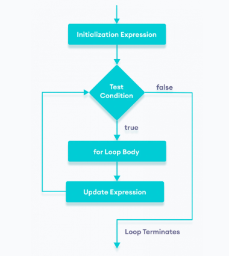

# For loop

## Definition

A for statement repeatedly executes a section of code so long as a given condition is true.

`source` [link](https://www.youtube.com/watch?v=yS8DUrQy_ow&list=PLBlnK6fEyqRh6isJ01MBnbNpV3ZsktSyS&index=11)

## Flow chart



## Syntax

```C++
for ( initializer ; condition; counter_update)
{
    // statement
}
```

## Example

```c++
#include <iostream>
int main()
{
    for (int i=1;i<=10;i++)
    {
        std::cout <<"Hello there"<<std::endl;
    }
    return 0;
}
```
