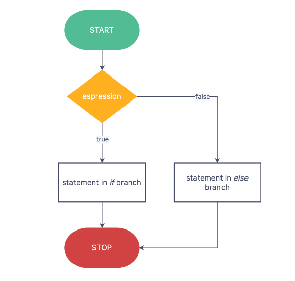

# If

## Definition

Check if the condition is true it runs the statement.

## Flowchart



## Syntax

```c++
if (condition)
{
    // Statement
}
```

## Example

```c++
#include <iostream>
int main()
{
    int num = 0;
    std::cout<<"Enter any number."<<std::endl;
    std::cin >> num;
    if (num > 10)
    {
        std::cout << "The number is greater than 10.";
    }
}
```
