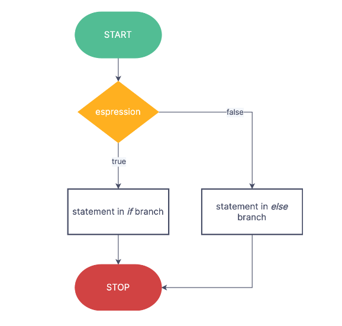

# If else

## Definition

Check if the condition is true it runs the statement and if the condition is false it runs the next statement.

## Flowchart

### if else flow chart



### else_if flow chart


## Syntax

### if_else syntax

```c++
if (condition)
{
    // Statement
}
else
{
    // Statement
}
```

### else_if syntax

```c++

    if(condition)
    {
        //statement
    }
    else if (condition)
    {
        //statement
    }
    else
    {
        //statement
    }
```

## Example

### if_else example

```c++
#include <iostream>
int main()
{
    int num = 0;
    std::cout<<"Enter any number."<<std::endl;
    std::cin >> num;
    if (num > 10)
    {
        std::cout << "The number is greater than 10.";
    }
    else 
    {
        std::cout << "The number is less than 10.";
    }
}
```

### else_if example

```c++

```
