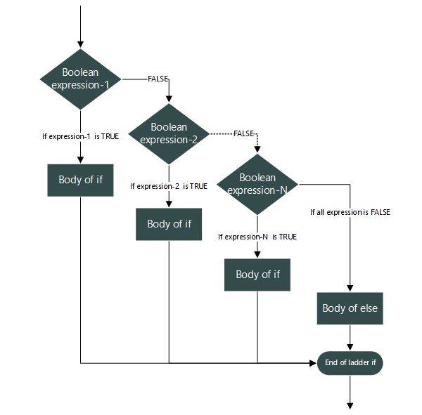

# else if

## Flowchart

### else_if flow chart



## Syntax

### else_if syntax

```c++

    if(condition)
    {
        //statement
    }
    else if (condition)
    {
        //statement
    }
    else
    {
        //statement
    }
```

## Example

### else_if example

```c++
#include <iostream>

int main()
{
    int time;
    std::cin >> time;
    if (time < 10)
    {
        std::cout<<"Good morning.";
    }
    else if (time<20)
    {
        std::cout<<"Good evening";
    }
    else
    {
        std::cout<<"Good Evening";
    }
    return 0;
}
```
